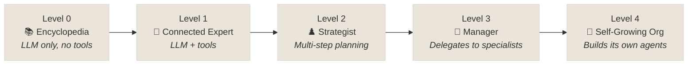

# PART 2 — Taxonomy: What Kind of Agent Are You Building?

---

## The 5 Levels — From Brain to Self-Evolving System

### The Intuition

Think of hiring: you wouldn't hire a contractor without knowing the job scope. Same here — pick the right level of agent for the complexity of the task.



---

### Level 0: Core Reasoning System (The Encyclopedia)

- **What**: LLM alone, no tools, no memory
- **What it can do**: Answer from training data
- **Production use**: FAQ chatbot on known, static content
- **Limit**: Knowledge cutoff. Can't act. Can't look things up.

---

### Level 1: The Connected Problem-Solver

- **What**: LLM + external tools (Search, Calculator, DB queries)
- **What it can do**: Answer about real-time events, current data
- **Production use**: Customer support agent that can look up order status
- **Technique**: Function calling — the LLM decides which tool to use, ADK executes it

---

### Level 2: The Strategic Problem-Solver

- **What**: LLM + tools + **planning** (multi-step, uses output of step N as input to step N+1)
- **The Key Concept**: **Context Engineering** — the output of one step is shaped into precise input for the next
- **Production example (coffee shop case)**:

```
Step 1: maps_tool("Mountain View", "SF") → "Millbrae"
Step 2: search_tool("good coffee in Millbrae")  <-- uses output from step 1
```

- **Production use**: Research agent, code review pipeline, document analysis workflows

---

### Level 3: The Collaborative Multi-Agent System

- **What**: A "Project Manager" agent + specialized sub-agents
- **Why not one giant agent**: Specialization. Each agent has a focused system prompt, relevant tools, and smaller context → cheaper, faster, more reliable
- **Production example — Product Launch**:

```
OrchestratorAgent --> MarketingAgent   (writes press release)
                  --> WebDevAgent      (builds landing page)
                  --> DataAgent        (pulls competitor analysis)
```

- **Communication**: Agents share state via `session.state` (Google ADK) or A2A protocol

---

### Level 4: The Self-Evolving System

- **What**: System creates new tools or new agents *on the fly* when it detects a capability gap
- **Production use**: Very experimental. Research/internal automation. Not for customer-facing production yet.
- **The key skill**: Agent identifies "I don't have a tool for this" and generates one dynamically

---

## Session, State, and Memory

Understanding how agents track context across a conversation is foundational:

| Concept | What it is |
|---|---|
| **Session** | The current conversation thread |
| **State** (`session.state`) | Key-value data within the current session — the agent's scratchpad |
| **Memory** | Searchable, cross-session information — persists beyond a single conversation |

ADK provides separate service implementations for each: `SessionService` manages session objects, `MemoryService` manages long-term memory.

### State: The Session's Scratchpad

`session.state` is a dictionary of key-value pairs the agent reads and writes during a conversation. It holds everything the agent needs to recall to make the current conversation effective — user preferences set earlier, intermediate results, decisions already made.

```python
# Writing to state
session.state["user_name"] = "Sachin"
session.state["preferred_currency"] = "EUR"

# Reading from state in the next turn
name = session.state.get("user_name")
```

State is scoped to the session. When the session ends, state is gone — unless explicitly promoted to long-term Memory.

---

## The A2A Protocol

The **Agent2Agent (A2A) Protocol** is an open standard for communication between independent AI agent systems. It enables agents to:

- **Discover** other agents' capabilities (via Agent Cards)
- **Manage collaborative tasks** asynchronously across agent boundaries
- **Securely exchange information** without exposing internal state, memory, or tools

A2A is the external communication layer — where `session.state` handles intra-agent state within a single runtime, A2A handles inter-agent coordination across separate systems.

---

## The Production Trap

::: warning
Building at Level 3 or 4 before you've validated Level 1. Most production failures come from over-engineering the agent architecture before the individual agent is proven to work reliably on its own task.
:::

Start at the lowest level that solves the problem. Add complexity only when you hit a real limit.

---

## Recall Hook

> **Encyclopedia → Expert → Strategist → Manager → Self-Growing Org** — pick your level before you write a line of code.

---

## Sources

- Google ADK Whitepaper: [Introduction to Agents](https://drive.google.com/file/d/1C-HvqgxM7dj4G2kCQLnuMXi1fTpXRdpx/view)
- Google ADK: [Session, State, and Memory](https://adk.dev/sessions/)
- [A2A Protocol Specification](https://a2a-protocol.org/latest/specification/)

<div class="contribute-cta">

**Know a production example of each level?** [Add it here](https://github.com/sac34333/aiharness/edit/main/docs/guide/agent-taxonomy.md) — real examples make this more useful.

</div>
