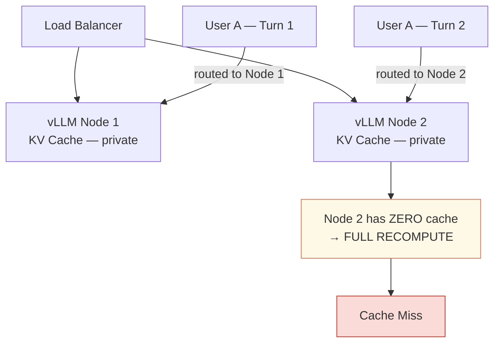
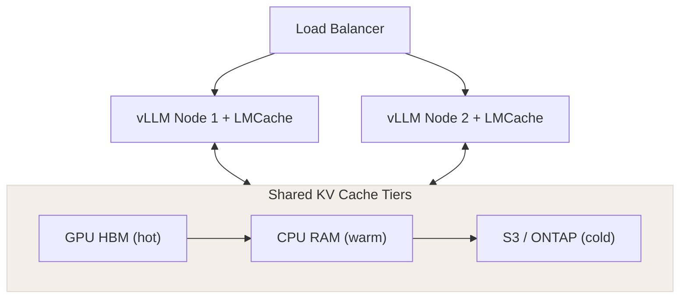

# Part 6a — KV Cache: GPU-Level Inference Caching

> Sources: NetApp Engineering Blog (Mar 2026) · NVIDIA Developer Blog (Sep 2025) · HPCWire (May 2026)

---

## The Intuition

Imagine you are answering questions about a 500-page book. Without a cache, you re-read the entire book from page 1 every time someone asks a new question. That is what an LLM does without KV cache — it recomputes attention over the *entire* context on every single new token it generates.

---

## The Technical Reality

In a transformer's attention mechanism, every token attends to all previous tokens:

$$\text{Attention}(Q, K, V) = \text{softmax}\left(\frac{Q \cdot K^T}{\sqrt{d_k}}\right) \cdot V$$

For each new token, the model needs K and V tensors for all previous tokens. Without caching, these are recomputed every time.

<div class="compare-grid">
<div class="compare-col bad">
<h4>Without KV Cache</h4>

- `[token 1][token 2]...[token N]`
- Compute K,V for **ALL** tokens every step
- **O(n²)** per token generated
- GPU overloaded
- High latency · High cost

</div>
<div class="compare-col good">
<h4>With KV Cache</h4>

**KV Cache (GPU HBM)** stores K₁,V₁ K₂,V₂ … Kₙ,Vₙ

- New token → compute only K_new, V_new → append
- **O(n)** per token generated
- Cache hit → retrieve fast
- GPU freed · Low latency

</div>
</div>

**What's cached**: Static prefix (system prompt + tools) is computed once and cached forever. Dynamic suffix (user messages, tool results) are appended each turn.

---

## KV Cache at Scale — The Memory Budget Problem

**Real numbers** (from NVIDIA blog): Llama 3 70B with a 128k token context window for a *single user* consumes ~40 GB of KV cache. At batch size 10 users → 400 GB. That is more than most GPUs have.

```
KV CACHE FIXED MEMORY POOL
+-------------------------------------------------+
|  [user1 K/V blocks] [user2 K/V blocks] [...]  |
|  ################################### <- FULL   |
+-------------------------------------------------+
              | when full
   K/V EVICTIONS (LRU policy)
   Evicted user's next request -> CACHE MISS
   Cache miss -> full recompute -> latency spike
```

**vLLM's Paged KV Cache**: Borrowed from OS virtual memory. KV tensors stored in fixed-size pages instead of contiguous blocks.

Key win: **Shared Prefix Pages** — 1000 users sharing the same RAG context → stored *once* as shared prefix pages → massive memory efficiency.

---

## The Multi-Node Problem: Where Scale Gets Really Hard

> Source: NetApp — "Engineering Inference: KV Cache, Shared Storage, and the Economics of AI" (2026)

**Single vLLM node**: clean, automatic prefix reuse, boringly simple.

**Add a second node behind a load balancer**: the rules change completely.



**LMCache** solves this by treating KV cache as *shared infrastructure* rather than private per-node memory:



**Critical config**: Use `kv_role: "kv_both"` (not just prefill OR decode). Decode-only caching creates subtle mismatches between what was cached during prefill and what is needed during generation.

**NetApp finding**: Adding the S3 tier shows *virtually no downside* because S3 and CPU tiers operate synergistically — S3 catches overflow from CPU RAM without hurting latency for hot entries.

---

## NVIDIA Unified Memory: Hardware-Level Solution (GH200 / Grace Blackwell)

> Source: NVIDIA Developer Blog (Sep 2025)

The OOM problem made concrete:
- Llama 3 70B in FP16 → needs ~140 GB GPU memory. GH200 has 96 GB → OOM error.
- Solution: **NVLink-C2C** — 900 GB/s interconnect between CPU (480 GB LPDDR) and GPU (96 GB HBM), creating a single unified address space. 7× the bandwidth of PCIe Gen 5.

```python
import rmm
import torch
from rmm.allocators.torch import rmm_torch_allocator

# Enable unified memory — GPU can now transparently spill to CPU RAM
rmm.reinitialize(managed_memory=True)
torch.cuda.memory.change_current_allocator(rmm_torch_allocator)

# Now loads without OOM — hardware handles data movement automatically
pipe = pipeline("text-generation", model="meta-llama/Llama-3.1-70B")
```

---

## The Economics Argument

> "Training made the headlines. Inference pays the power bill." — NetApp/HPCWire 2026

KV cache reuse + quantization together change the economics:
- **Reused KV block** = GPU compute you did not pay for twice
- **CPU/S3 offload** = memory pressure not pushed onto expensive accelerators
- **Unified memory** = serve larger models without OOM, without buying more GPUs

The companies that win will not throw the most GPUs at the problem — they will engineer smarter inference paths.

---

## Recall Hook

> **Single node: vLLM Paged KV. Multi-node: LMCache + shared tiers (GPU→CPU→S3). Hardware limit: NVIDIA unified memory. Economics: inference > training costs now.**

---

## Sources

- [NetApp — Engineering Inference: KV Cache, Shared Storage and the Economics of AI](https://community.netapp.com/t5/Tech-ONTAP-Blogs/Engineering-Inference-KV-Cache-Shared-Storage-and-the-Economics-of-AI/ba-p/466018) (Mar 2026)
- [NVIDIA — Accelerate LLM Inference and KV Cache Offload with CPU-GPU Memory Sharing](https://developer.nvidia.com/blog/accelerate-large-scale-llm-inference-and-kv-cache-offload-with-cpu-gpu-memory-sharing/) (Sep 2025)
- [HPCWire — Why the Race to Expand KV Cache is Critical for AI Inference Success](https://www.hpcwire.com/2026/05/11/why-the-race-to-expand-kv-cache-is-critical-for-ai-inference-success/) (May 2026)

<div class="contribute-cta">

**Running vLLM or LMCache in production?** [Add your config](https://github.com/sac34333/aiharness/edit/main/docs/guide/kv-cache.md) — specific tuning data is rare and useful.

</div>
